# サーバ構築入門(Apache/WordPress)

## 1. はじめに

この講座では, VirtualMachineを使って演習を行います。必ずVMWare環境を用意してください。授業とは別にVMを用意しておくことをオススメします。

## 2. Linuxについて

Linuxとは当時、大学生であったLinus Torvaldsが開発したOS(オペレーティングシステム)です。UNIX互換のOSとして開発されました。Linuxのプログラムの特徴としてライセンス形態が挙げられます。Linuxのプログラムには`GPL(GNU General Public License)というライセンス形式が付与されています。これには以下の内容が含まれています。

> - プログラムを実行する自由
> - ソースの改変の自由
> - 利用・再配布の自由
> - 改良したプログラムをリリースする権利
>
> (Linux標準教科書より引用)

こうした自由な形態を採用した為、限られた組織や個人によって独占されることなく広く普及し発展しました。詳しいことは`書籍:Unix考古学`などに書かれています。

## 3. サーバの基本情報

サーバとは不特定多数によるアクセスが可能なコンピュータ。

### 実験環境

- VMware Workstation Player 12.7
- Ubuntu 17.10 x86_64

### VMの起動

VMware Playerを起動してVMを立ち上げます。

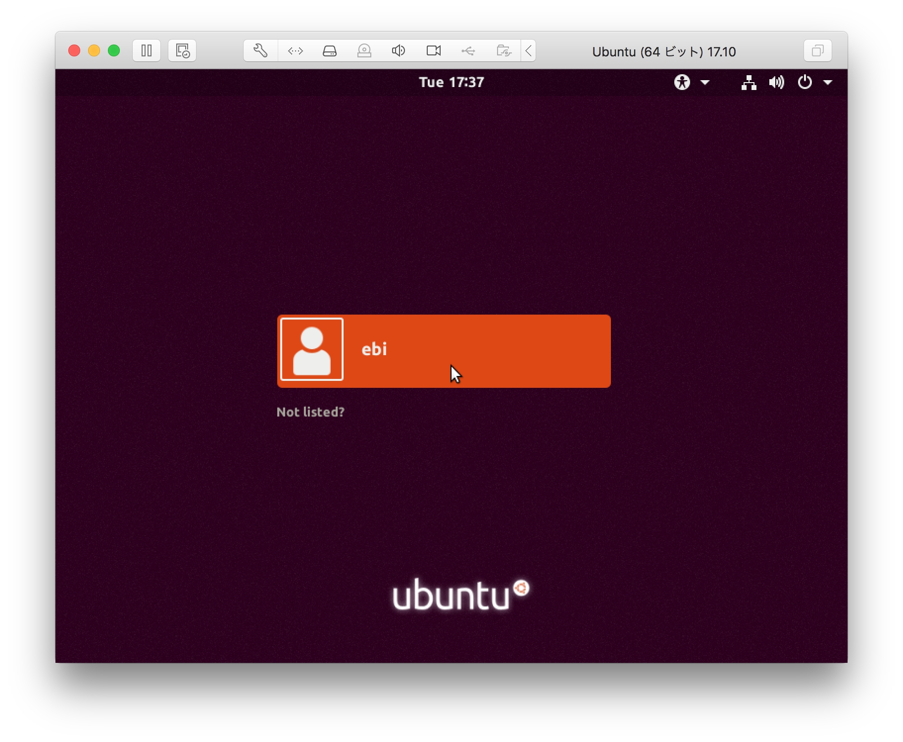

VMが起動してログインします。

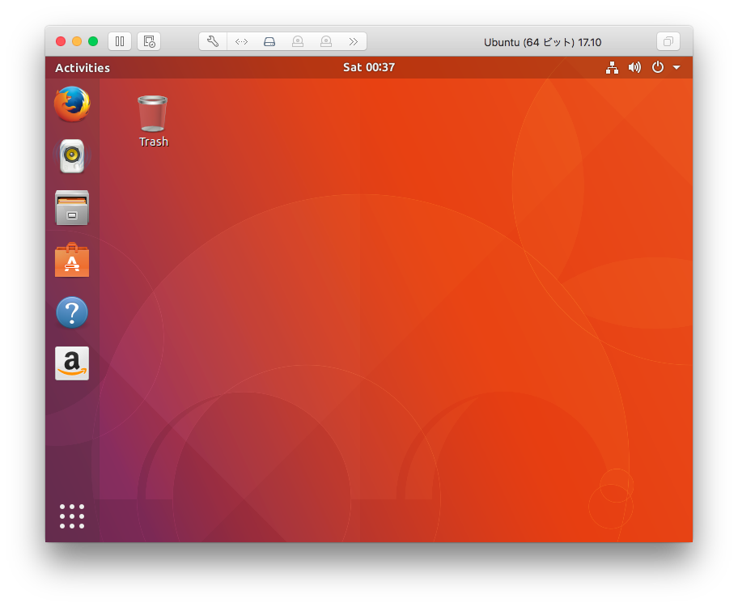


左下のボタン（ランチャ）から`Terminal`を起動します

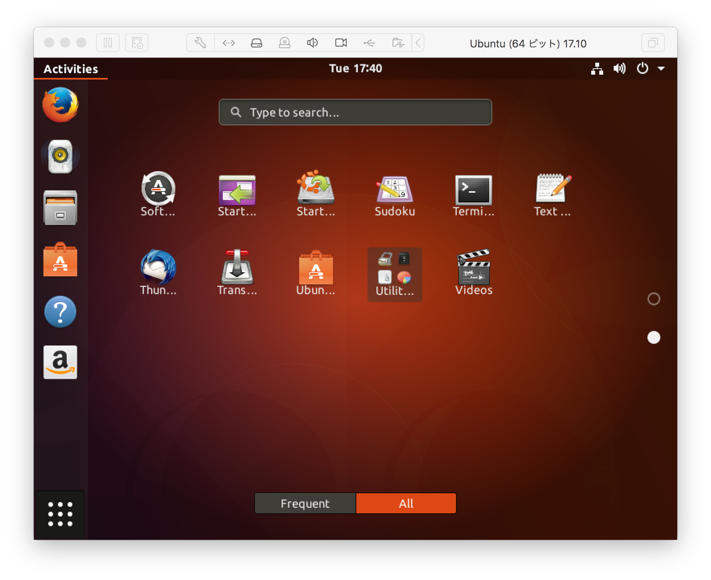

起動すると以下の画面が表示されます

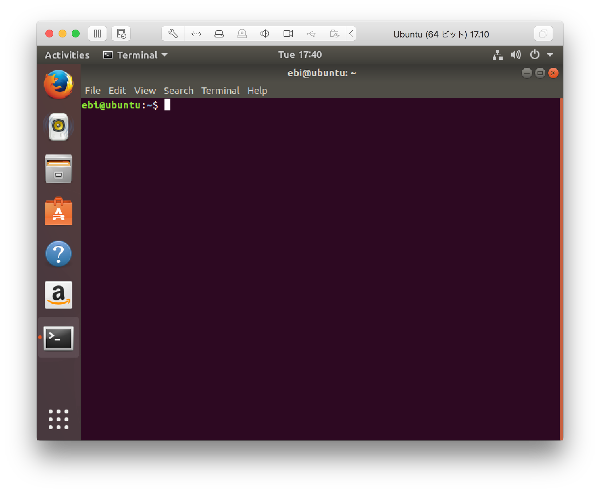

### 日本語対応及び国内リポジトリに変更

このままでは、日本語の対応が不安定だったり、aptのサーバーがアメリカの設定でパッケージをインストールする時に若干時間がかかるので日本で使うのに適した設定にします。

```
    echo "export LANG=ja_JP.UTF-8" >> $HOME/.bashrc
    
    wget -q https://www.ubuntulinux.jp/ubuntu-ja-archive-keyring.gpg -O- | sudo apt-key add -
    
    wget -q https://www.ubuntulinux.jp/ubuntu-jp-ppa-keyring.gpg -O- | sudo apt-key add -
    
    sudo wget https://www.ubuntulinux.jp/sources.list.d/artful.list -O /etc/apt/sources.list.d/ubuntu-ja.list
    
    sudo apt update
    
    sudo apt dist-upgrade
    
    sudo apt install ubuntu-defaults-ja
    
    sudo systemctl reboot -i
```

### ネットワークまわり

#### IPアドレスの確認

IPアドレスを確認します。ターミナルに`ip a`を入力します。

	ebi@ubuntu:~$ ip a
	1: lo: <LOOPBACK,UP,LOWER_UP> mtu 65536 qdisc noqueue state UNKNOWN group default qlen 1000
	    link/loopback 00:00:00:00:00:00 brd 00:00:00:00:00:00
	    inet 127.0.0.1/8 scope host lo
	       valid_lft forever preferred_lft forever
	    inet6 ::1/128 scope host
	       valid_lft forever preferred_lft forever
	2: ens33: <BROADCAST,MULTICAST,UP,LOWER_UP> mtu 1500 qdisc pfifo_fast state UP group default qlen 1000
	    link/ether 00:0c:29:90:d5:eb brd ff:ff:ff:ff:ff:ff
	    inet 192.168.223.159/24 brd 192.168.223.255 scope global dynamic ens33
	       valid_lft 1152sec preferred_lft 1152sec
	    inet6 fe80::a8dc:fd46:8a0b:d3e9/64 scope link
	       valid_lft forever preferred_lft forever

ここで`inet x.x.x.x (192.168.x.xや172.16.x.x)`という文字列が見つかります。これがローカルネットワークにおけるIPアドレスです。

ローカルネットワークのIPアドレスは国際標準規格`RFC1918`によって下記の範囲で定められています。

|クラス|IPアドレス範囲|
|---|---|
|A|10.0.0.0	-	10.255.255.255 (10/8 prefix)|
|B|172.16.0.0	-	172.31.255.255 (172.16/12 prefix)|
|C|192.168.0.0	-	192.168.255.255 (192.168/16 prefix)|

参考: [プライベート網のアドレス割当(RFC 1918) - JPNIC](https://www.nic.ad.jp/ja/translation/rfc/1918.html)

今回使ったNAT設定は、仮想マシン(Virtual Machine)からのパケットを実機(Windows)でアドレスやポート変換して外部と通信します。

#### 疎通の確認

次に`pingコマンド`を利用してネットワーク通信が行えるか確認します。ターミナルに`ping 8.8.8.8`と入力してEnterを押下します。終了するには`Ctrl + C`を押します。

	ebi@ubuntu:~$ ping 8.8.8.8
	PING 8.8.8.8 (8.8.8.8) 56(84) bytes of data.
	64 bytes from 8.8.8.8: icmp_seq=1 ttl=128 time=4.43 ms
	64 bytes from 8.8.8.8: icmp_seq=2 ttl=128 time=4.78 ms
	64 bytes from 8.8.8.8: icmp_seq=3 ttl=128 time=3.98 ms
	64 bytes from 8.8.8.8: icmp_seq=4 ttl=128 time=4.30 ms
	64 bytes from 8.8.8.8: icmp_seq=5 ttl=128 time=5.06 ms
	^C
	--- 8.8.8.8 ping statistics ---
	5 packets transmitted, 5 received, 0% packet loss, time 4010ms
	rtt min/avg/max/mdev = 3.987/4.515/5.061/0.376 ms

	ebi@ubuntu:~$ ping 8.8.8.7
	PING 8.8.8.7 (8.8.8.7) 56(84) bytes of data.
	^C
	--- 8.8.8.7 ping statistics ---
	7 packets transmitted, 0 received, 100% packet loss, time 6128ms

サーバからの応答があれば外部との通信が出来ていると判断できます。

### パッケージのインストール

#### パッケージマネージャについて

ソフトウェアをインストールします。Windowsでソフトウェアをインストールするには、インストーラをダウンロードして実行する必要があります。

Linuxにはソフトウェアを一元管理しているパッケージマネージャという便利な仕組みがあります。この仕組みによってソフトウェアをパッケージという単位でコマンドを使って管理できるようになります。

#### パッケージのインストール

コマンド`sudo apt install [パッケージ名]`を入力することでパッケージがインストールされます。

## 4. Webサーバの構築

次にApacheというWebサーバソフトウェアをパッケージマネージャと利用してインストールします。ターミナルに以下のコマンドを打ち込みます。

`sudo apt install apache2`

	ebi@ubuntu:~$ sudo apt install apache2
	[sudo] ebi のパスワード:
	パッケージリストを読み込んでいます... 完了
	依存関係ツリーを作成しています
	状態情報を読み取っています... 完了
	以下の追加パッケージがインストールされます:
	  apache2-bin apache2-data apache2-utils libapr1 libaprutil1
	  libaprutil1-dbd-sqlite3 libaprutil1-ldap
	提案パッケージ:
	  apache2-doc apache2-suexec-pristine | apache2-suexec-custom
	以下のパッケージが新たにインストールされます:
	  apache2 apache2-bin apache2-data apache2-utils libapr1 libaprutil1
	  libaprutil1-dbd-sqlite3 libaprutil1-ldap
	アップグレード: 0 個、新規インストール: 8 個、削除: 0 個、保留: 0 個。
	1,502 kB のアーカイブを取得する必要があります。
	この操作後に追加で 6,175 kB のディスク容量が消費されます。
	続行しますか? [Y/n] y

確認が出るので`y`を入力して`Enter`を押します.

	取得:1 http://jp.archive.ubuntu.com/ubuntu artful/main amd64 libapr1 amd64 1.6.2-1 [90.9 kB]
	取得:2 http://jp.archive.ubuntu.com/ubuntu artful/main amd64 libaprutil1 amd64 1.6.0-2 [84.2 kB]
	取得:3 http://jp.archive.ubuntu.com/ubuntu artful/main amd64 libaprutil1-dbd-sqlite3 amd64 1.6.0-2 [10.5 kB]
	取得:4 http://jp.archive.ubuntu.com/ubuntu artful/main amd64 libaprutil1-ldap amd64 1.6.0-2 [8,660 B]
	取得:5 http://jp.archive.ubuntu.com/ubuntu artful/main amd64 apache2-bin amd64 2.4.27-2ubuntu3 [968 kB]
	取得:6 http://jp.archive.ubuntu.com/ubuntu artful/main amd64 apache2-utils amd64 2.4.27-2ubuntu3 [82.5 kB]
	取得:7 http://jp.archive.ubuntu.com/ubuntu artful/main amd64 apache2-data all 2.4.27-2ubuntu3 [161 kB]
	取得:8 http://jp.archive.ubuntu.com/ubuntu artful/main amd64 apache2 amd64 2.4.27-2ubuntu3 [95.8 kB]
	1,502 kB を 0秒 で取得しました (5,591 kB/s)
	以前に未選択のパッケージ libapr1:amd64 を選択しています。
	(データベースを読み込んでいます ... 現在 113374 個のファイルとディレクトリがインストールされています。)
	.../0-libapr1_1.6.2-1_amd64.deb を展開する準備をしています ...
	libapr1:amd64 (1.6.2-1) を展開しています...
	以前に未選択のパッケージ libaprutil1:amd64 を選択しています。
	.../1-libaprutil1_1.6.0-2_amd64.deb を展開する準備をしています ...
	libaprutil1:amd64 (1.6.0-2) を展開しています...
	以前に未選択のパッケージ libaprutil1-dbd-sqlite3:amd64 を選択しています。
	.../2-libaprutil1-dbd-sqlite3_1.6.0-2_amd64.deb を展開する準備をしています ...
	libaprutil1-dbd-sqlite3:amd64 (1.6.0-2) を展開しています...
	以前に未選択のパッケージ libaprutil1-ldap:amd64 を選択しています。
	.../3-libaprutil1-ldap_1.6.0-2_amd64.deb を展開する準備をしています ...
	libaprutil1-ldap:amd64 (1.6.0-2) を展開しています...
	以前に未選択のパッケージ apache2-bin を選択しています。
	.../4-apache2-bin_2.4.27-2ubuntu3_amd64.deb を展開する準備をしています ...
	apache2-bin (2.4.27-2ubuntu3) を展開しています...
	以前に未選択のパッケージ apache2-utils を選択しています。
	.../5-apache2-utils_2.4.27-2ubuntu3_amd64.deb を展開する準備をしています ...
	apache2-utils (2.4.27-2ubuntu3) を展開しています...
	以前に未選択のパッケージ apache2-data を選択しています。
	.../6-apache2-data_2.4.27-2ubuntu3_all.deb を展開する準備をしています ...
	apache2-data (2.4.27-2ubuntu3) を展開しています...
	以前に未選択のパッケージ apache2 を選択しています。
	.../7-apache2_2.4.27-2ubuntu3_amd64.deb を展開する準備をしています ...
	apache2 (2.4.27-2ubuntu3) を展開しています...
	libapr1:amd64 (1.6.2-1) を設定しています ...
	ufw (0.35-5) のトリガを処理しています ...
	ureadahead (0.100.0-20) のトリガを処理しています ...
	apache2-data (2.4.27-2ubuntu3) を設定しています ...
	libc-bin (2.26-0ubuntu2) のトリガを処理しています ...
	libaprutil1:amd64 (1.6.0-2) を設定しています ...
	systemd (234-2ubuntu12) のトリガを処理しています ...
	man-db (2.7.6.1-2) のトリガを処理しています ...
	libaprutil1-ldap:amd64 (1.6.0-2) を設定しています ...
	libaprutil1-dbd-sqlite3:amd64 (1.6.0-2) を設定しています ...
	apache2-utils (2.4.27-2ubuntu3) を設定しています ...
	apache2-bin (2.4.27-2ubuntu3) を設定しています ...
	apache2 (2.4.27-2ubuntu3) を設定しています ...
	Enabling module mpm_event.
	Enabling module authz_core.
	Enabling module authz_host.
	Enabling module authn_core.
	Enabling module auth_basic.
	Enabling module access_compat.
	Enabling module authn_file.
	Enabling module authz_user.
	Enabling module alias.
	Enabling module dir.
	Enabling module autoindex.
	Enabling module env.
	Enabling module mime.
	Enabling module negotiation.
	Enabling module setenvif.
	Enabling module filter.
	Enabling module deflate.
	Enabling module status.
	Enabling module reqtimeout.
	Enabling conf charset.
	Enabling conf localized-error-pages.
	Enabling conf other-vhosts-access-log.
	Enabling conf security.
	Enabling conf serve-cgi-bin.
	Enabling site 000-default.
	Created symlink /etc/systemd/system/multi-user.target.wants/apache2.service → /lib/systemd/system/apache2.service.
	Created symlink /etc/systemd/system/multi-user.target.wants/apache-htcacheclean.service → /lib/systemd/system/apache-htcacheclean.service.
	libc-bin (2.26-0ubuntu2) のトリガを処理しています ...
	ureadahead (0.100.0-20) のトリガを処理しています ...
	systemd (234-2ubuntu12) のトリガを処理しています ...
	ufw (0.35-5) のトリガを処理しています ...

Apacheのインストールが完了しました。

### プロセスの確認

Linuxではアプリケーション1つひとつに**プロセスID**というIDが付与されます。これによってプロセスを区別しています。Windowsのタスクマネージャでプロセスが起動している様子をイメージすると分かりやすいです。

Apacheのインストールが終わるとApacheは自動で起動します。まず、Apacheのプロセスが存在するか`psコマンド`で確認します。

`ps aux | grep apache`

	ebi@ubuntu:~$ sudo ps -aux | grep apache
	root       2590  0.0  0.4  73856  4588 ?        Ss   11:49   0:00 /usr/sbin/apache2 -k start
	www-data   2592  0.0  0.4 821768  4428 ?        Sl   11:49   0:00 /usr/sbin/apache2 -k start
	www-data   2593  0.0  0.4 821768  4428 ?        Sl   11:49   0:00 /usr/sbin/apache2 -k start
	ebi        2853  0.0  0.1  15380  1052 pts/0    S+   11:57   0:00 grep --color=auto apache

表示された結果の1番左が`プロセスが実行されたユーザ`、左から2番目が`プロセスID`、一番右が`プロセスの実行内容(コマンド)`をそれぞれ表しています。これでApacheのプロセスが起動していることが確認できます。

### ポート状況の確認

ポート開放状況は`ss`を使って確認します。`| grep -i xxx`の部分で大文字小文字の区別なく`xxx`という文字列を検索します。

	ebi@ubuntu:~$ ss -ant | grep -i listen
	LISTEN     0      128          *:22                       *:*
	LISTEN     0      5      127.0.0.1:631                      *:*
	LISTEN     0      128          *:5355                     *:*
	LISTEN     0      128         :::22                      :::*
	LISTEN     0      5          ::1:631                     :::*
	LISTEN     0      128         :::5355                    :::*
	LISTEN     0      128         :::80                      :::*

以下の行を見ることで`TCP 80番ポート`が開放されていると分かります。

	ebi@ubuntu:~$ ss -ant | grep -i listen
	(略)
	LISTEN     0      128         :::80                      :::*

以下に主要なポートの一覧をあげます。

|ポート番号|プロトコル|サービス名|
|---|---|---|
|80|TCP|HTTP|
|53|UDP|DNS|
|22|TCP|SSH|
|443|TCP|HTTPS|

### PHP(プログラミング言語)のインストール

プログラミング言語PHPの実行に必要なパッケージをインストールします。

`sudo apt install libapache2-mod-php libapache2-mod-php7.1 php-common php7.1-cli php7.1-common php7.1-json php7.1-opcache php7.1-readline php7.1-gd php7.1-xmlrpc php7.1-dev php7.1-mbstring php7.1-mysql`

	ebi@ubuntu:~$ sudo apt install libapache2-mod-php libapache2-mod-php7.1 php-common php7.1-cli php7.1-common php7.1-json php7.1-opcache php7.1-readline php7.1-gd php7.1-xmlrpc php7.1-dev php7.1-mbstring php7.1-mysql
	パッケージリストを読み込んでいます... 完了
	依存関係ツリーを作成しています
	状態情報を読み取っています... 完了
	以下の追加パッケージがインストールされます:
	  autoconf automake autopoint autotools-dev binutils binutils-common binutils-x86-64-linux-gnu build-essential debhelper dh-autoreconf
	  dh-strip-nondeterminism dpkg-dev fakeroot g++ g++-7 gcc gcc-7 gettext intltool-debian libalgorithm-diff-perl libalgorithm-diff-xs-perl
	  libalgorithm-merge-perl libarchive-cpio-perl libarchive-zip-perl libasan4 libatomic1 libbinutils libc-dev-bin libc6-dev libcc1-0
	  libcilkrts5 libdpkg-perl libfakeroot libfile-fcntllock-perl libfile-stripnondeterminism-perl libgcc-7-dev libitm1 liblsan0 libltdl-dev
	  libmail-sendmail-perl libmpx2 libpcre16-3 libpcre3-dev libpcre32-3 libpcrecpp0v5 libsigsegv2 libssl-dev libssl-doc libstdc++-7-dev
	  libsys-hostname-long-perl libtool libtsan0 libubsan0 libxmlrpc-epi0 linux-libc-dev m4 make manpages-dev php-pear php-xml php7.1-xml
	  pkg-php-tools po-debconf shtool zlib1g-dev
	提案パッケージ:
	  autoconf-archive gnu-standards autoconf-doc binutils-doc dh-make debian-keyring g++-multilib g++-7-multilib gcc-7-doc libstdc++6-7-dbg
	  gcc-multilib flex bison gdb gcc-doc gcc-7-multilib gcc-7-locales libgcc1-dbg libgomp1-dbg libitm1-dbg libatomic1-dbg libasan4-dbg
	  liblsan0-dbg libtsan0-dbg libubsan0-dbg libcilkrts5-dbg libmpx2-dbg libquadmath0-dbg gettext-doc libasprintf-dev libgettextpo-dev
	  glibc-doc libtool-doc libstdc++-7-doc gfortran | fortran95-compiler gcj-jdk m4-doc make-doc dh-php libmail-box-perl
	以下のパッケージが新たにインストールされます:
	  autoconf automake autopoint autotools-dev binutils binutils-common binutils-x86-64-linux-gnu build-essential debhelper dh-autoreconf
	  dh-strip-nondeterminism dpkg-dev fakeroot g++ g++-7 gcc gcc-7 gettext intltool-debian libalgorithm-diff-perl libalgorithm-diff-xs-perl
	  libalgorithm-merge-perl libapache2-mod-php libapache2-mod-php7.1 libarchive-cpio-perl libarchive-zip-perl libasan4 libatomic1
	  libbinutils libc-dev-bin libc6-dev libcc1-0 libcilkrts5 libdpkg-perl libfakeroot libfile-fcntllock-perl libfile-stripnondeterminism-perl
	  libgcc-7-dev libitm1 liblsan0 libltdl-dev libmail-sendmail-perl libmpx2 libpcre16-3 libpcre3-dev libpcre32-3 libpcrecpp0v5 libsigsegv2
	  libssl-dev libssl-doc libstdc++-7-dev libsys-hostname-long-perl libtool libtsan0 libubsan0 libxmlrpc-epi0 linux-libc-dev m4 make
	  manpages-dev php-common php-pear php-xml php7.1-cli php7.1-common php7.1-dev php7.1-gd php7.1-json php7.1-mbstring php7.1-mysql
	  php7.1-opcache php7.1-readline php7.1-xml php7.1-xmlrpc pkg-php-tools po-debconf shtool zlib1g-dev
	アップグレード: 0 個、新規インストール: 78 個、削除: 0 個、保留: 0 個。
	42.3 MB のアーカイブを取得する必要があります。
	この操作後に追加で 185 MB のディスク容量が消費されます。
	続行しますか? [Y/n] y

キー`y`を押して`Enter`で続行します。

	取得:1 http://jp.archive.ubuntu.com/ubuntu artful/main amd64 libsigsegv2 amd64 2.11-1 [13.2 kB]
	取得:2 http://jp.archive.ubuntu.com/ubuntu artful/main amd64 m4 amd64 1.4.18-1 [197 kB]
	取得:3 http://jp.archive.ubuntu.com/ubuntu artful/main amd64 autoconf all 2.69-11 [322 kB]
	取得:4 http://jp.archive.ubuntu.com/ubuntu artful/main amd64 autotools-dev all 20161112.1 [39.5 kB]
	取得:5 http://jp.archive.ubuntu.com/ubuntu artful/main amd64 automake all 1:1.15-6ubuntu1 [509 kB]
	取得:6 http://jp.archive.ubuntu.com/ubuntu artful/main amd64 autopoint all 0.19.8.1-4ubuntu1 [412 kB]
	取得:7 http://jp.archive.ubuntu.com/ubuntu artful/main amd64 binutils-common amd64 2.29.1-4ubuntu1 [190 kB]
	取得:8 http://jp.archive.ubuntu.com/ubuntu artful/main amd64 libbinutils amd64 2.29.1-4ubuntu1 [502 kB]
	取得:9 http://jp.archive.ubuntu.com/ubuntu artful/main amd64 binutils-x86-64-linux-gnu amd64 2.29.1-4ubuntu1 [1,824 kB]
	取得:10 http://jp.archive.ubuntu.com/ubuntu artful/main amd64 binutils amd64 2.29.1-4ubuntu1 [3,342 B]
	取得:11 http://jp.archive.ubuntu.com/ubuntu artful/main amd64 libc-dev-bin amd64 2.26-0ubuntu2 [69.6 kB]
	取得:12 http://jp.archive.ubuntu.com/ubuntu artful/main amd64 linux-libc-dev amd64 4.13.0-16.19 [954 kB]
	取得:13 http://jp.archive.ubuntu.com/ubuntu artful/main amd64 libc6-dev amd64 2.26-0ubuntu2 [2,524 kB]
	取得:14 http://jp.archive.ubuntu.com/ubuntu artful/main amd64 libcc1-0 amd64 7.2.0-8ubuntu3 [38.6 kB]
	取得:15 http://jp.archive.ubuntu.com/ubuntu artful/main amd64 libitm1 amd64 7.2.0-8ubuntu3 [27.6 kB]
	取得:16 http://jp.archive.ubuntu.com/ubuntu artful/main amd64 libatomic1 amd64 7.2.0-8ubuntu3 [8,954 B]
	取得:17 http://jp.archive.ubuntu.com/ubuntu artful/main amd64 libasan4 amd64 7.2.0-8ubuntu3 [360 kB]
	取得:18 http://jp.archive.ubuntu.com/ubuntu artful/main amd64 liblsan0 amd64 7.2.0-8ubuntu3 [133 kB]
	取得:19 http://jp.archive.ubuntu.com/ubuntu artful/main amd64 libtsan0 amd64 7.2.0-8ubuntu3 [282 kB]
	取得:20 http://jp.archive.ubuntu.com/ubuntu artful/main amd64 libubsan0 amd64 7.2.0-8ubuntu3 [126 kB]
	取得:21 http://jp.archive.ubuntu.com/ubuntu artful/main amd64 libcilkrts5 amd64 7.2.0-8ubuntu3 [42.5 kB]
	取得:22 http://jp.archive.ubuntu.com/ubuntu artful/main amd64 libmpx2 amd64 7.2.0-8ubuntu3 [11.7 kB]
	取得:23 http://jp.archive.ubuntu.com/ubuntu artful/main amd64 libgcc-7-dev amd64 7.2.0-8ubuntu3 [2,378 kB]
	取得:24 http://jp.archive.ubuntu.com/ubuntu artful/main amd64 gcc-7 amd64 7.2.0-8ubuntu3 [7,411 kB]
	取得:25 http://jp.archive.ubuntu.com/ubuntu artful/main amd64 gcc amd64 4:7.2.0-1ubuntu1 [5,124 B]
	取得:26 http://jp.archive.ubuntu.com/ubuntu artful/main amd64 libstdc++-7-dev amd64 7.2.0-8ubuntu3 [1,456 kB]
	取得:27 http://jp.archive.ubuntu.com/ubuntu artful/main amd64 g++-7 amd64 7.2.0-8ubuntu3 [7,551 kB]
	取得:28 http://jp.archive.ubuntu.com/ubuntu artful/main amd64 g++ amd64 4:7.2.0-1ubuntu1 [1,482 B]
	取得:29 http://jp.archive.ubuntu.com/ubuntu artful/main amd64 make amd64 4.1-9.1 [154 kB]
	取得:30 http://jp.archive.ubuntu.com/ubuntu artful/main amd64 libdpkg-perl all 1.18.24ubuntu1 [209 kB]
	取得:31 http://jp.archive.ubuntu.com/ubuntu artful/main amd64 dpkg-dev all 1.18.24ubuntu1 [608 kB]
	取得:32 http://jp.archive.ubuntu.com/ubuntu artful/main amd64 build-essential amd64 12.4ubuntu1 [4,758 B]
	取得:33 http://jp.archive.ubuntu.com/ubuntu artful/main amd64 libtool all 2.4.6-2 [194 kB]
	取得:34 http://jp.archive.ubuntu.com/ubuntu artful/main amd64 dh-autoreconf all 14 [15.5 kB]
	取得:35 http://jp.archive.ubuntu.com/ubuntu artful/main amd64 libarchive-zip-perl all 1.59-1 [84.0 kB]
	取得:36 http://jp.archive.ubuntu.com/ubuntu artful/main amd64 libfile-stripnondeterminism-perl all 0.038-1 [13.3 kB]
	取得:37 http://jp.archive.ubuntu.com/ubuntu artful/main amd64 dh-strip-nondeterminism all 0.038-1 [5,026 B]
	取得:38 http://jp.archive.ubuntu.com/ubuntu artful/main amd64 gettext amd64 0.19.8.1-4ubuntu1 [1,093 kB]
	取得:39 http://jp.archive.ubuntu.com/ubuntu artful/main amd64 intltool-debian all 0.35.0+20060710.4 [24.9 kB]
	取得:40 http://jp.archive.ubuntu.com/ubuntu artful/main amd64 po-debconf all 1.0.20 [232 kB]
	取得:41 http://jp.archive.ubuntu.com/ubuntu artful/main amd64 debhelper all 10.7.2ubuntu2 [877 kB]
	取得:42 http://jp.archive.ubuntu.com/ubuntu artful/main amd64 libfakeroot amd64 1.21-1ubuntu2 [25.9 kB]
	php7.1-opcache (7.1.8-1ubuntu1) を設定しています ...

	Creating config file /etc/php/7.1/mods-available/opcache.ini with new version
	binutils-x86-64-linux-gnu (2.29.1-4ubuntu1) を設定しています ...
	php-xml (1:7.1+54ubuntu1) を設定しています ...
	php7.1-cli (7.1.8-1ubuntu1) を設定しています ...
	update-alternatives: /usr/bin/php (php) を提供するために自動モードで /usr/bin/php7.1 を使います
	update-alternatives: /usr/bin/phar (phar) を提供するために自動モードで /usr/bin/phar7.1 を使います
	update-alternatives: /usr/bin/phar.phar (phar.phar) を提供するために自動モードで /usr/bin/phar.phar7.1 を使います

	Creating config file /etc/php/7.1/cli/php.ini with new version
	php-pear (1:1.10.5+submodules+notgz-1) を設定しています ...
	binutils (2.29.1-4ubuntu1) を設定しています ...
	libapache2-mod-php7.1 (7.1.8-1ubuntu1) を設定しています ...

	Creating config file /etc/php/7.1/apache2/php.ini with new version
	Module mpm_event disabled.
	Enabling module mpm_prefork.
	apache2_switch_mpm Switch to prefork
	apache2_invoke: Enable module php7.1
	libapache2-mod-php (1:7.1+54ubuntu1) を設定しています ...
	gcc-7 (7.2.0-8ubuntu3) を設定しています ...
	g++-7 (7.2.0-8ubuntu3) を設定しています ...
	gcc (4:7.2.0-1ubuntu1) を設定しています ...
	dpkg-dev (1.18.24ubuntu1) を設定しています ...
	g++ (4:7.2.0-1ubuntu1) を設定しています ...
	update-alternatives: /usr/bin/c++ (c++) を提供するために自動モードで /usr/bin/g++ を使います
	libtool (2.4.6-2) を設定しています ...
	build-essential (12.4ubuntu1) を設定しています ...
	php7.1-dev (7.1.8-1ubuntu1) を設定しています ...
	update-alternatives: /usr/bin/php-config (php-config) を提供するために自動モードで /usr/bin/php-config7.1 を使います
	update-alternatives: /usr/bin/phpize (phpize) を提供するために自動モードで /usr/bin/phpize7.1 を使います
	dh-autoreconf (14) を設定しています ...
	dh-strip-nondeterminism (0.038-1) を設定しています ...
	debhelper (10.7.2ubuntu2) を設定しています ...
	pkg-php-tools (1.35) を設定しています ...
	libc-bin (2.26-0ubuntu2) のトリガを処理しています ...

**ApacheでPHPを使うためのパッケージ**

- libapache2-mod-php
- libapache2-mod-php7.1

**WordPressで必要となるPHPのパッケージ**

- php-common
- php7.1-cli
- php7.1-common
- php7.1-json
- php7.1-opcache
- php7.1-readline
- php7.1-gd
- php7.1-xmlrpc
- php7.1-dev
- php7.1-mbstring
- php7.1-mysql

### PHPの設定

edit confs

## 5. MySQLデータベースのインストール

MySQLデータベースをインストールします。

`sudo apt install mysql-common mysql-server mysql-client`

	ebi@ubuntu:~$ sudo apt install mysql-common mysql-server mysql-client
	[sudo] ebi のパスワード:
	パッケージリストを読み込んでいます... 完了
	依存関係ツリーを作成しています
	状態情報を読み取っています... 完了
	mysql-common はすでに最新バージョン (5.8+1.0.2ubuntu1) です。
	mysql-common は手動でインストールしたと設定されました。
	以下の追加パッケージがインストールされます:
	  libaio1 libcgi-fast-perl libcgi-pm-perl libevent-core-2.1-6 libfcgi-perl libhtml-mplate-perl mysql-client-5.7 mysql-client-core-5.7
	  mysql-server-5.7 mysql-server-core-5.7
	提案パッケージ:
	  libipc-sharedcache-perl mailx tinyca
	以下のパッケージが新たにインストールされます:
	  libaio1 libcgi-fast-perl libcgi-pm-perl libevent-core-2.1-6 libfcgi-perl libhtml-mplate-perl mysql-client mysql-client-5.7
	  mysql-client-core-5.7 mysql-server mysql-server-5.7 mysql-server-core-5.7
	アップグレード: 0 個、新規インストール: 12 個、削除: 0 個、保留: 5 個。
	20.6 MB のアーカイブを取得する必要があります。
	この操作後に追加で 161 MB のディスク容量が消費されます。
 	続行しますか? [Y/n] y

確認が出るので`y`を入力して`Enter`を押します.

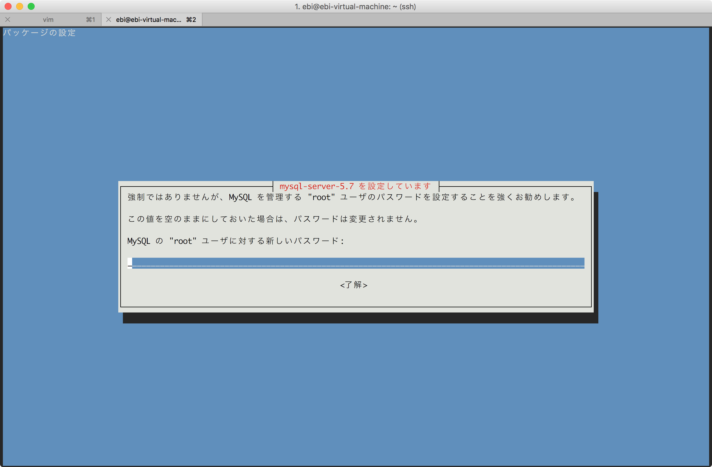

パスワード入力を求められるので任意のパスワードを設定します。ここでは`k@pp@ebi1000`と設定しました。

	(略)
	以前に未選択のパッケージ libfcgi-perl を選択しています。
	.../07-libfcgi-perl_0.78-2build1_amd64.deb を展開する準備をしています ...
	libfcgi-perl (0.78-2build1) を展開しています...
	以前に未選択のパッケージ libcgi-fast-perl を選択しています。
	.../08-libcgi-fast-perl_1%3a2.12-1_all.deb を展開する準備をしています ...
	libcgi-fast-perl (1:2.12-1) を展開しています...
	以前に未選択のパッケージ libhtml-template-perl を選択しています。
	.../09-libhtml-template-perl_2.95-2_all.deb を展開する準備をしています ...
	libhtml-template-perl (2.95-2) を展開しています...
	以前に未選択のパッケージ mysql-client を選択しています。
	.../10-mysql-client_5.7.20-0ubuntu0.17.10.1_all.deb を展開する準備をしています ...
	mysql-client (5.7.20-0ubuntu0.17.10.1) を展開しています...
	以前に未選択のパッケージ mysql-server を選択しています。
	.../11-mysql-server_5.7.20-0ubuntu0.17.10.1_all.deb を展開する準備をしています ...
	mysql-server (5.7.20-0ubuntu0.17.10.1) を展開しています...
	libevent-core-2.1-6:amd64 (2.1.8-stable-4) を設定しています ...
	ureadahead (0.100.0-20) のトリガを処理しています ...
	libc-bin (2.26-0ubuntu2) のトリガを処理しています ...
	libaio1:amd64 (0.3.110-4) を設定しています ...
	systemd (234-2ubuntu12) のトリガを処理しています ...
	libcgi-pm-perl (4.36-1) を設定しています ...
	man-db (2.7.6.1-2) のトリガを処理しています ...
	mysql-client-core-5.7 (5.7.20-0ubuntu0.17.10.1) を設定しています ...
	libfcgi-perl (0.78-2build1) を設定しています ...
	libhtml-template-perl (2.95-2) を設定しています ...
	mysql-server-core-5.7 (5.7.20-0ubuntu0.17.10.1) を設定しています ...
	libcgi-fast-perl (1:2.12-1) を設定しています ...
	mysql-client-5.7 (5.7.20-0ubuntu0.17.10.1) を設定しています ...
	mysql-client (5.7.20-0ubuntu0.17.10.1) を設定しています ...
	mysql-server-5.7 (5.7.20-0ubuntu0.17.10.1) を設定しています ...
	update-alternatives: /etc/mysql/my.cnf (my.cnf) を提供するために自動モードで /etc/mysql/mysql.cnf を使います
	Renaming removed key_buffer and myisam-recover options (if present)
	Created symlink /etc/systemd/system/multi-user.target.wants/mysql.service → /lib/systemd/stem/mysql.service.
	mysql-server (5.7.20-0ubuntu0.17.10.1) を設定しています ...
	libc-bin (2.26-0ubuntu2) のトリガを処理しています ...
	ureadahead (0.100.0-20) のトリガを処理しています ...
	systemd (234-2ubuntu12) のトリガを処理しています ...

	インストールが完了したら、データベースサーバに接続します。

	データベース・サーバが起動しているかポート状況を確認します。

#### 練習

データベース・サーバはTCP 3306番で起動します。サーバが起動しているか確認してみよう。

ヒント: `ssコマンド`

#### 練習2

MySQLサーバが起動しているか確認してみます。プロセス一覧には`mysql`という文字列が含まれています。

ヒント: `psコマンド`

---

### MySQLへログイン

MySQLサーバへログインします。

`sudo mysql -uroot -pk@pp@ebi1000`

```
	ebi@ubuntu:~$ mysql -uroot -pk@pp@ebi1000
	mysql: [Warning] Using a password on the command line interface can be insecure.
	Welcome to the MySQL monitor.  Commands end with ; or \g.
	Your MySQL connection id is 7
	Server version: 5.7.20-0ubuntu0.17.10.1 (Ubuntu)

	Copyright (c) 2000, 2017, Oracle and/or its affiliates. All rights reserved.

	Oracle is a registered trademark of Oracle Corporation and/or its
	affiliates. Other names may be trademarks of their respective
	owners.

	Type 'help;' or '\h' for help. Type '\c' to clear the current input statement.

	mysql>
```

### MySQLにデータベースを追加

存在しているデータベースをコマンド`show databases;`で表示します。

	mysql> show databases;
	+--------------------+
	| Database           |
	+--------------------+
	| information_schema |
	| mysql              |
	| performance_schema |
	| sys                |
	+--------------------+
	4 rows in set (0.01 sec)
	mysql>

WordPressで使用するデータベースを作成します。`wordpress`という名前のデータベースを作成します。

	mysql> create database wordpress;
	mysql>

#### 練習

`wordpress`というデータベースが作成されているか確認してみましょう。

ヒント: `show ???`というコマンド使う。

	mysql> show ???;
	+--------------------+
	| Database           |
	+--------------------+
	| information_schema |
	| mysql              |
	| performance_schema |
	| sys                |
	| wordpress          |
	+--------------------+
	5 rows in set (0.02 sec)

---

### MySQLのユーザを追加

MySQLのユーザ`wp-user`を追加します。`root`を使用することも出来ますが、アカウントが悪用された時の影響範囲を小さくするために新たなユーザを追加しています。

- ユーザ名:`wp-user`
- パスワード:`kabayaki3taro`

```
	mysql> create user 'wp-user'@'localhost' identified by 'kabayaki3taro';
	Query OK, 0 rows affected (0.00 sec)
```

ユーザ`wp-user`にデータベース`wordpress`へのフルアクセス権を付与します。

	mysql> grant all privileges on wordpress.* to 'wp-user'@'localhost';
	Query OK, 0 rows affected (0.00 sec)

### データベースのテーブルを確認

データベース`wordpress`の中身であるテーブルを確認してみます。

まず、データベース`wordpress`を選択します。

	mysql> use wordpress;
	Database changed
	mysql>

次に、テーブルの一覧を表示します。

	mysql> show tables;
	Empty set (0.03 sec)
	mysql>

実行結果から、まだ何もテーブルが作成されていないことが確認できます。

一度、MySQLから抜けます。

	mysql> quit
	Bye

## 6. WordPressのインストール

### WordPressについて

WordPressはオープンソース(ソースコードが公開されている)のブログシステムです。カスタマイズすることでWebサイトとして使用することも出来ます。

安倍首相のWebサイト、学内サイト、緊急連絡サイトなど身近なWebサイトでも使用されています。

### WordPressのダウンロード

WordPressの公式サイトへアクセスし、WordPressをダウンロードします。次のリンクをブラウザで開きます。

[日本語 — WordPress](https://ja.wordpress.org/)

サイトの「WordPress 4.8.2 をダウンロード」にカーソルをおき、`右クリック -> リンクのアドレスをコピー`を選択します。

適当なディレクトリに移動し、Virtual Machineのターミナルで`wget `と入力し、`右クリック -> ペースト`からコピーしたURLを貼り付けます。

`wget https://ja.wordpress.org/wordpress-4.8.2-ja.zip`

実行したコマンドは上記です。`wget`コマンドは指定したURLのファイルをダウンロードするコマンドです。つまり、WordPressのプログラムをWebからダウンロードしました。

### WordPressの展開と設置

ダウンロードしたファイル`wordpress-4.8.2-ja.zip`を`unzip`コマンドで解凍します。

	ebi@ubuntu:~$ unzip wordpress-4.8.2-ja.zip
	Archive:  wordpress-4.8.2-ja.zip
	   creating: wordpress/
	  inflating: wordpress/wp-trackback.php
	   creating: wordpress/wp-admin/
	  inflating: wordpress/wp-admin/media-upload.php
	  inflating: wordpress/wp-admin/install-helper.php
	  inflating: wordpress/wp-admin/ms-users.php
	  inflating: wordpress/wp-admin/menu-header.php
	  inflating: wordpress/wp-admin/update.php
	  inflating: wordpress/wp-admin/plugin-install.php
	  inflating: wordpress/wp-admin/theme-editor.php
	   creating: wordpress/wp-admin/images/
		(略)
	  inflating: wordpress/wp-settings.php
	  inflating: wordpress/wp-cron.php
	  inflating: wordpress/wp-login.php
	  inflating: wordpress/wp-activate.php
	  inflating: wordpress/license.txt
	  inflating: wordpress/wp-signup.php
	  inflating: wordpress/index.php
	  inflating: wordpress/wp-mail.php
	  inflating: wordpress/wp-config-sample.php
	  inflating: wordpress/wp-comments-post.php

---

展開すると`wordpress`というディレクトリが存在します。このディレクトリを`/var/www/`へ移動します。

`sudo mv wordpress/ /var/www/html/`

続いて`/var/www/html/`へ移動します。

`cd /var/www/html`

ファイルのパーミッションを確認します。

#### 練習

コマンドを使ってファイルのパーミッションをチェックしてみましょう。また、`index.html`の所有者を確認してみましょう。

ヒント: `ls`コマンド

---

ディレクトリ`wordpress`の所有者を`ebi`から`www-data`へ変更します。`-R`でディレクトリ内にあるファイルやディレクトリを再帰的に変更します。

`sudo chown -R www-data: wordpress/`

### Webブラウザからアクセス

VMのIPアドレスを確認します。ホスト(Windows)でWebブラウザ(Google ChromeやFirefox)を起動します。

ブラウザのアドレス欄へ `http://IPアドレス/wordpresss/`　を入力してアクセスします。

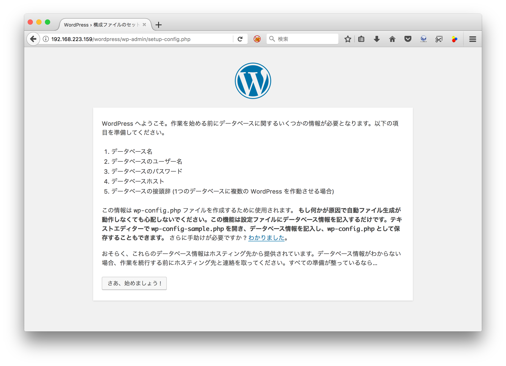

ページに表示される「さあ、始めましょう」をクリックします。

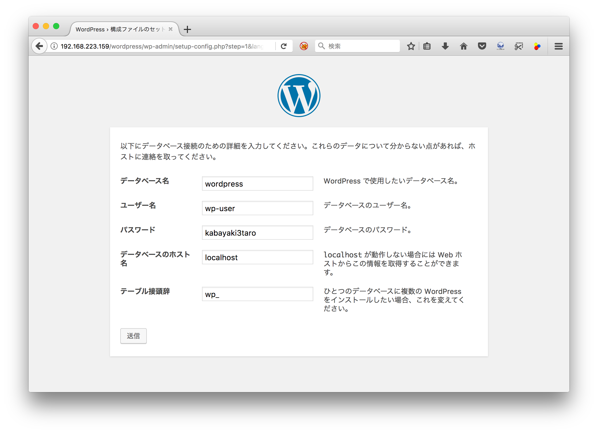

フォームに上記内容を入力します。

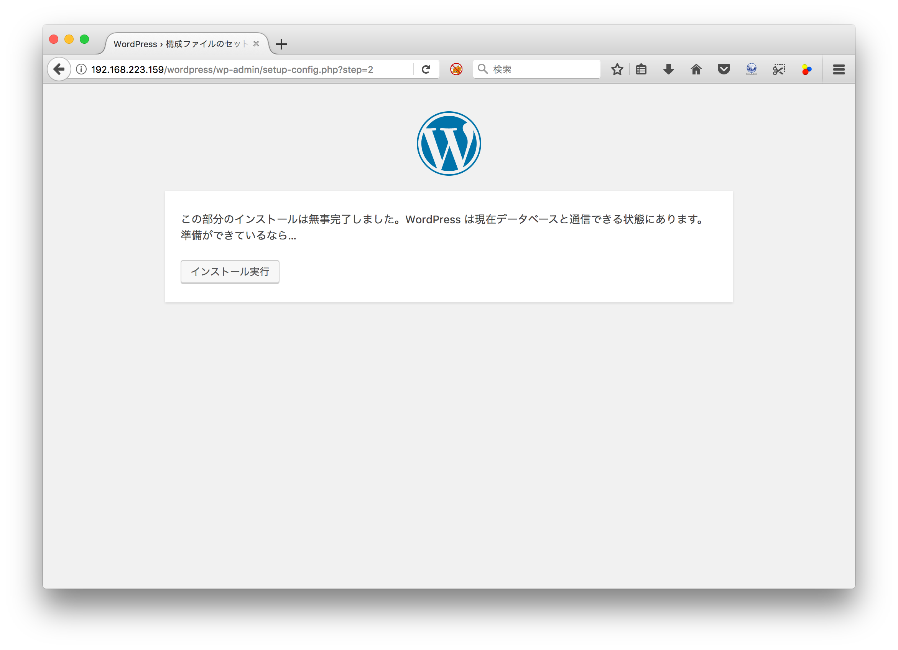

「インストール実行」をクリックします。

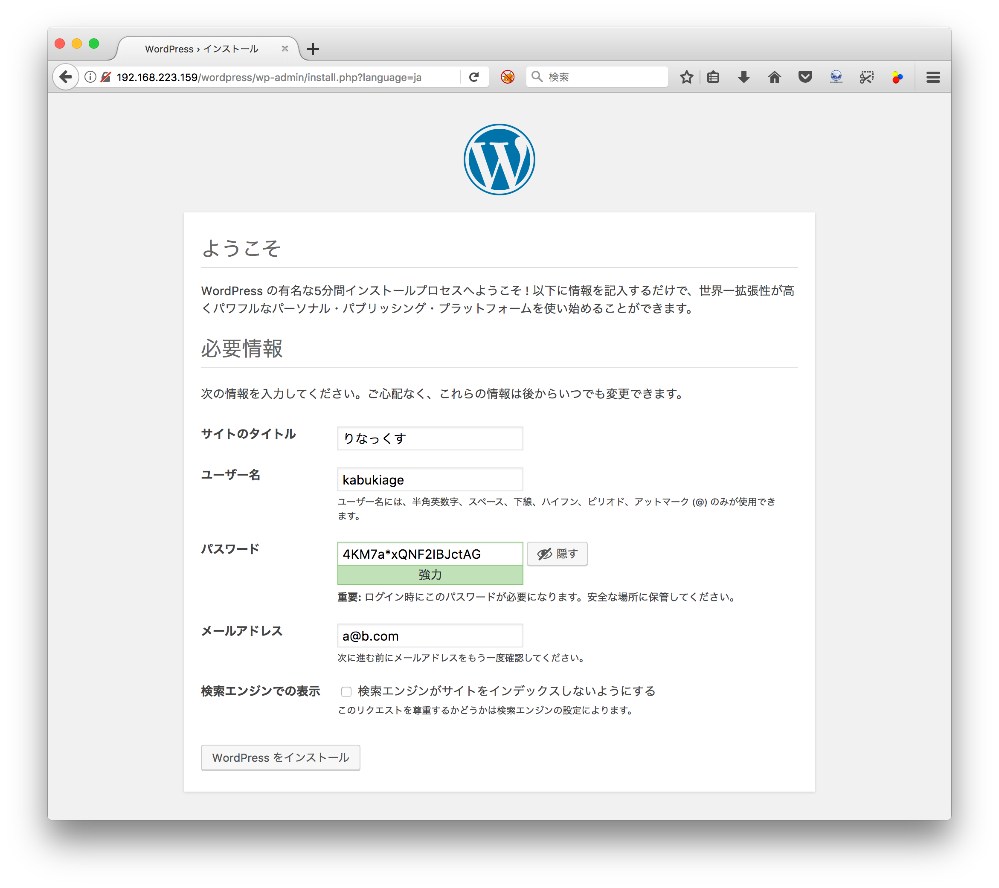

サイト情報を好きなように設定します。ユーザ名とパスワードは別途、メモしてください。メールアドレスは適当なアドレスで良いです。入力後、「WordPressをインストール」をクリックします。

- サイト名: りなっくす
- ユーザ名: kabukiage
- パスワード: 4KM7a*xQNF2IBJctAG
- メールアドレス: a@b.com

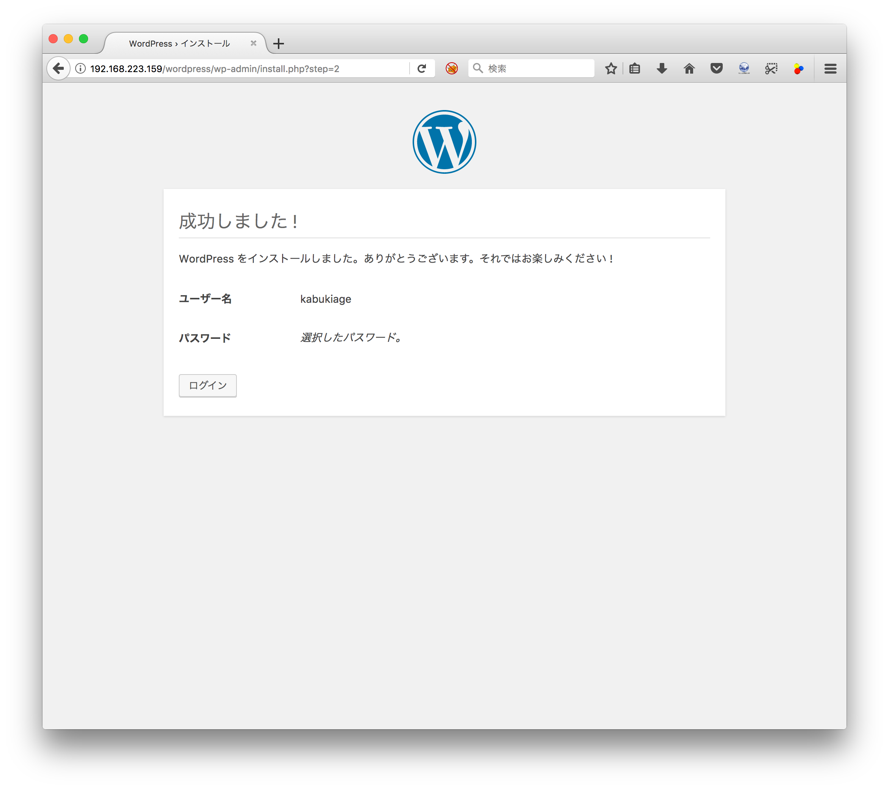

インストールに成功すると上記画面が表示されます。「ログイン」をクリックするとログイン画面に移動します。

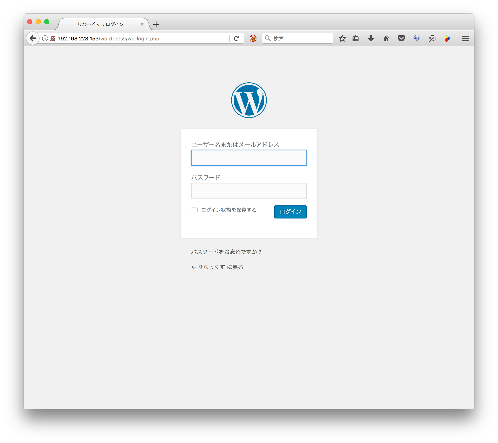

さきほど設定したパスワードとユーザ名を入力し「ログイン」をクリックします。ログインすると管理画面が表示されます。左上にあるサイト表示から構築したサイトを見ることができます。


#### 練習

=======
管理画面で「テーマ」をインストールして適用させてオリジナルサイトをつくってみてください。


### MySQLデータベースを確認

WordPressによって、空だったデータベース`wordpress`のテーブルがどう変化しているか確認します。

	mysql> show databases;
	+--------------------+
	| Database           |
	+--------------------+
	| information_schema |
	| mysql              |
	| performance_schema |
	| sys                |
	| wordpress          |
	+--------------------+
	5 rows in set (0.02 sec)

	mysql> use wordpress;
	Reading table information for completion of table and column names
	You can turn off this feature to get a quicker startup with -A

	Database changed

	mysql> show tables;
	+-----------------------+
	| Tables_in_wordpress   |
	+-----------------------+
	| wp_commentmeta        |
	| wp_comments           |
	| wp_links              |
	| wp_options            |
	| wp_postmeta           |
	| wp_posts              |
	| wp_term_relationships |
	| wp_term_taxonomy      |
	| wp_termmeta           |
	| wp_terms              |
	| wp_usermeta           |
	| wp_users              |
	+-----------------------+
	12 rows in set (0.00 sec)

データベース`wordpress`のテーブル`wp_users`の中身は以下のコマンド確認できます。

	mysql> select * from wp_users;
	+----+------------+------------------------------------+---------------+------------+----------+---------------------+---------------------+-------------+--------------+
	| ID | user_login | user_pass                          | user_nicename | user_email | user_url | user_registered     | user_activation_key | user_status | display_name |
	+----+------------+------------------------------------+---------------+------------+----------+---------------------+---------------------+-------------+--------------+
	|  1 | kabukiage  | $P$BHrhfHenRfBgNwayaCck.GKddKzwK11 | kabukiage     | a@b.com    |          | 2017-10-31 13:06:13 |                     |           0 | kabukiage    |
	+----+------------+------------------------------------+---------------+------------+----------+---------------------+---------------------+-------------+--------------+
	1 row in set (0.00 sec)

## 6. まとめ

サーバの構築を通じて、「サーバ」や「ネットワーク」の仕組みがどう変化しているかについて理解が深まれば幸いです。大切な視点は、各サーバが「何のため」に「何をしている」か理解することが大切です。

## 7. ちょっと小話
最近、「ApacheじゃなくてNginx(エンジンエックス)のほうがいい」というのをよく聞くと思います。ではなにが良いのかってことでNginxとApacheの違いを簡単に説明していきたいと思います。

#### Apache
ApacheはHTTPに特化したサーバーで、webサーバーとしての機能が豊富に用意してあります。またmodをインストールすることで機能を簡単に追加することができます。今回もPHPを使うために`libapache2-mod-php`をインストールしました。

Apacheはプロセス駆動型で一つリクエストに対し一つのプロセスを割り当てて処理を行います。そのため大量のアクセスが同時に来た場合、プロセスも大量に起動することになり、最悪C10Kと呼ばれるプロセス番号が足らなくなる現象が発生します(UNIX系OSだと最大32767)。またPHPなどの処理もApacheのプロセスで実行されるため、動的サイトの動作が重くなる傾向があります。

#### Nginx
NginxはApacheで述べた問題を解決することを目標に作られたもので、Webサーバーとしての機能だけでなく、リバースプロキシとして動作したりなど様々な機能がありますが、機能追加をするときにはソースからコンパイルしなおさなければなりません(HTTP/2やTLSv1.3に対応させるなど...)

Nginxではプロセス数はCPUのコア数と同等で、それぞれのプロセスの中でループ処理をまわし、キューに溜まったイベントをしていく方式(イベントループ)です。

またPHPなどの処理を外部に投げることにより、処理の高速化とNginxプロセスの肥大化を抑制しています。

##### 結局どっちがいいのか

使用用途による

- 静的なサイトでアクセス多数    ->     Apache
- 動的なサイトでアクセス多数    ->     Nginx
- アクセス少数                  ->     どっちでも変わらない

まぁ気にしなくて大丈夫

動的サイト(WordPressとか)を高速にしたいならNginx

簡単にサッサと建てたいならApache
