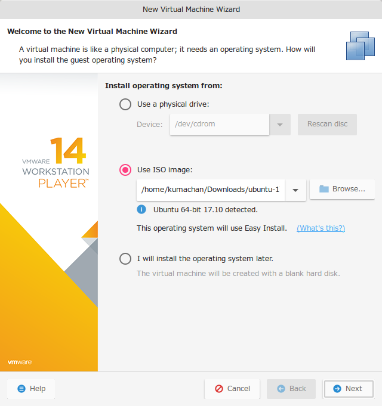

### Ubuntu のインストール
まずハンズオン用の環境を作るために、VMware PlayerにUbuntuをインストールしていきます。

1. VMware Playerを起動して、右ペイン一番上の項目を選択し、仮想マシンウィザードを立ち上げて下さい。

    

1. 「Use ISO image」からISOイメージを選択して「Next」をクリックして下さい。ISOイメージを選択することで自動的にOSが認識されVMの設定が最適化されます。

    

1. Ubuntuにログインするための認証情報を設定して下さい。ここで入力した情報でUbuntuの認証情報が設定されます。画像では以下の設定になっています。
    ```
    Full name :  ebi
    User name :  ebi
    Password  :  kappaebi1000
    Confirm   :  kappaebi1000
    ```
    

1. 仮想マシンの名前と場所を設定します。名前は分かりやすいものを、場所は十分に空き容量があるボリュームに設定して下さい。

    

1. 仮想マシンに接続する仮想ハードディスクのサイズを設定します。とりあえず20GBで大丈夫だと思いますのでこのまま次に進んで下さい。

    

1. 仮想マシンに対する設定が完了しました。このまま「Finish」をクリックすることで自動的にUbuntuがインストールされ、VMware-toolsも自動的に入ります。

    
